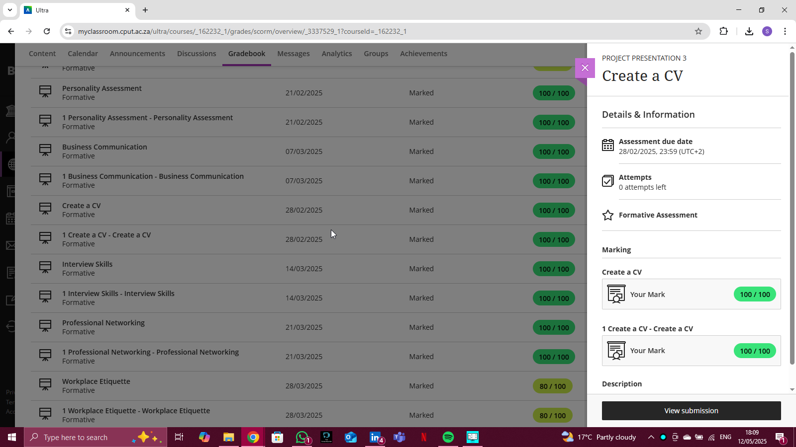

# Saadiqah Hendricks – E-Portfolio

> 🎓 *Information and Communication Technology Student: Applications Development

This space is a snapshot of my journey—full of creative sparks, challenges, and everything in between. From big ideas to tiny wins, it’s all about growth, curiosity, and the exciting path I’m carving out. Dive in and explore what I’ve been up to!
---

## 📌 Contents
- [Career Counselling](#-career-counselling)
- [Skills & Interests](#-skills--interests)
- [Personality Assessment](#-personality-assessment)
- [CV Creation](#-cv-creation)
- [CV Submission](#-cv-submission)
- [Final Reflection](#-final-reflection)

---

## 🧭 Career Counselling

Coming out of high school, I found myself uncertain about the specific career path to pursue. I took a deliberate approach and decided to take a couple of years to explore my interests, trying out different subjects and gaining exposure to various fields. This exploratory phase helped me understand that career choices are not always immediate, and it's okay to take time to identify what truly aligns with one's strengths and passions.

Through this period, I started recognizing that my interests leaned towards fields that combined creativity with technology. While I initially lacked clarity, I eventually found my calling in Information Technology, focusing on areas like applications development and UI/UX design. This reflective process emphasized the importance of career counselling and mentorship, as these resources were key in helping me clarify my goals.

As a result, I now have a better understanding of what I enjoy doing and how I can align my academic pursuits with a fulfilling career. The guidance from career professionals has been invaluable in showing me how to approach my career journey strategically, despite the initial uncertainty I faced.

Please view my personalized career advice document:
[View National Career Advice Portal PDF](./national-career-advice-portal.pdf)

One of the key resources that helped me understand career options in Information Technology was the [Careers in ICT – IITPSA](https://www.iitpsa.org.za/careers-in-ict-info/) page. It provided practical insights into different roles, including Applications Development, which sparked my interest in the field.

---

## 💡 Skills & Interests

Throughout my academic journey in Information and Communication Technology, I’ve developed a strong interest in backend development. My focus has consistently been on understanding how systems function behind the scenes—how data is processed, stored, and managed efficiently.

I’ve grown confident working with technologies such as **Java**, **SQL**, and database design. These tools have allowed me to build structured, logical solutions to complex problems. One of the most rewarding parts of my learning experience has been designing and implementing Java applications that interact with databases—this has not only sharpened my technical skills, but also helped me improve my ability to plan, debug, and manage code effectively.

These experiences have helped me develop the following key skills:
- Object-Oriented Programming (OOP) with Java  
- Database design and SQL querying  
- Writing clean, maintainable backend code  
- Debugging and error handling  
- Logical thinking and problem-solving  

While I continue to strengthen my skills in backend development, I’ve also come to appreciate how important it is to understand the full lifecycle of application development. I'm eager to explore how these skills can be applied in real-world environments where secure, scalable, and efficient systems are needed.

For a closer look at my personal projects and ongoing learning:

🔗 [My Personal Portfolio Website](https://saadiqahhendricks.github.io/)

---

## 🧬 Personality Assessment

Understanding my personality has helped me make more intentional decisions about my career direction. I consider myself a logical and detail-oriented individual, which naturally aligns with my interest in backend development—where structure, precision, and problem-solving are essential.

I am also a quiet, observant thinker who prefers meaningful collaboration over constant social interaction. This helps me thrive in environments where focus, independence, and depth of thought are valued. However, I am also adaptable and enjoy working in teams, especially when solving shared challenges or reviewing code collaboratively.

Some of the traits I’ve noticed that support my role in tech include:
- Strong analytical and critical thinking  
- Patience and persistence when solving problems  
- A calm, grounded approach under pressure  
- A desire to continuously learn and improve  
- Good listening skills and attention to detail  

These qualities have proven helpful both in academic group work and in independent coding tasks. They shape how I approach challenges and allow me to contribute thoughtfully to technical projects.

I believe that being aware of one’s personality isn’t just useful for career choice—it also helps build better working relationships and encourages growth in the right direction.

You can view my detailed personality assessment below:

[View My Personality Report (PDF)](./My%20Personality%20Test%20-%20Type%208.pdf)

---

## 📄 CV Creation

Finalizing my CV has been a valuable learning experience, as it allowed me to reflect on my academic journey and professional goals. It was an opportunity to ensure that all my skills, achievements, and aspirations were clearly presented. While creating the CV, I paid attention to the structure and formatting, making sure it was easy to read and tailored for the types of roles I am interested in.

Submitting the CV made me feel more confident in my professional identity and showed me how essential it is to constantly update and refine how I present myself in the job market. It also helped me realize that having a well-crafted CV is not just about listing qualifications, but about telling a story of growth, skills, and potential. This exercise gave me a clearer understanding of how to strategically position myself for future opportunities.

### Work-Integrated Learning (WIL) Module

The module I completed as part of my ICT studies included Work-Integrated Learning (WIL), which covered important career development aspects such as CV creation. This module was an essential step in preparing for my professional career, as it provided structured guidance on presenting my skills and achievements effectively.

Below is a screenshot of the module page where the CV creation process was discussed, along with other career readiness activities.

---

## 📬 CV Submission

Below is my completed CV, compiled during the Work Readiness and Work-Integrated Learning (WIL) module. It highlights my academic background, technical skills (especially in backend development), and professional interests.

📄 [View My CV](./CV.pdf)

In addition, I have been actively tracking my job search process, which is essential for monitoring progress and opportunities. Here is the log where I document applications, feedback, and notes on potential opportunities:

📄 [View My Job Search Log](./JOB%20SEARCH%20LOG.pdf)

---

## 🧩 Final Reflection

The journey through this portfolio has helped me reflect on my identity as both a student and an emerging IT professional. I’ve learned that it’s okay to still be exploring, but what matters is being intentional — with my learning, my projects, and my voice.

I’m excited to continue growing in areas like:
- 🌐 UI/UX design
- 📱 App development
- 🤖 AI and machine learning
- 🧠 Project management
- 🤝 Collaboration and team-building

> *“Every pixel, every paragraph, every project — a step forward.”*  

---

### 🔗 Connect with Me

💼 [LinkedIn](https://www.linkedin.com/in/saadiqahhendricks)  
💻 [My Projects on GitHub](https://saadiqahhendricks.github.io/)
